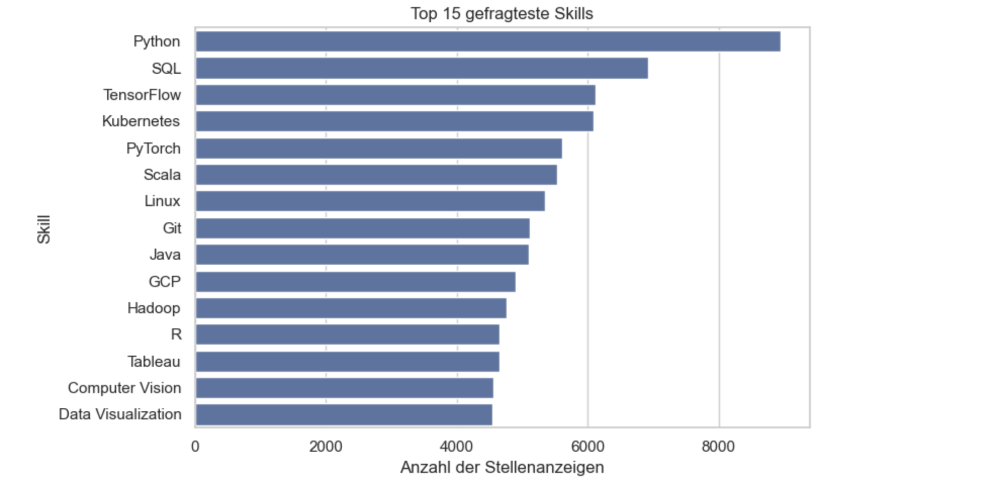
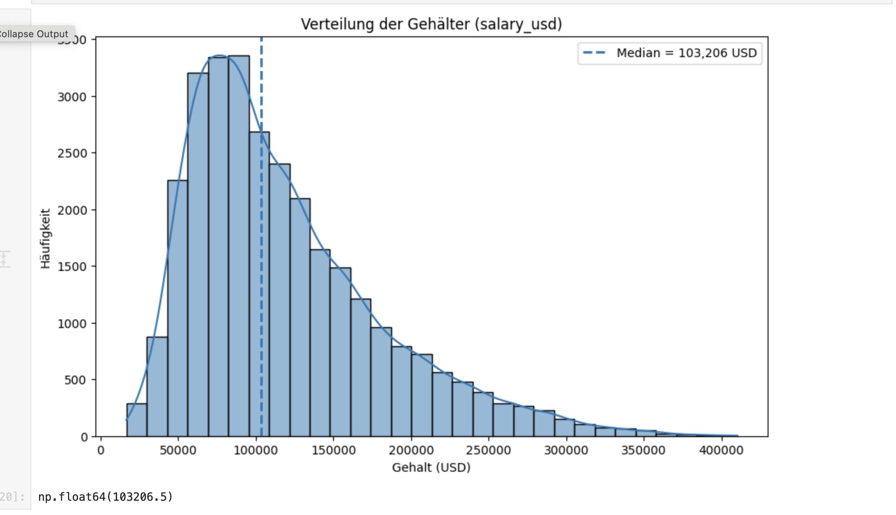
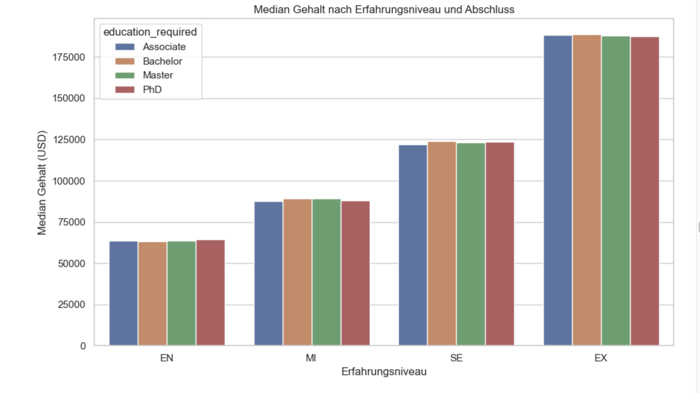
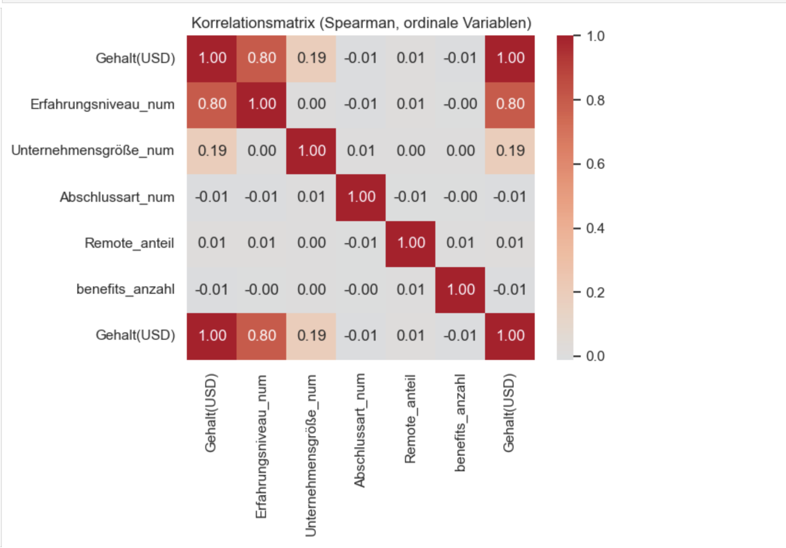
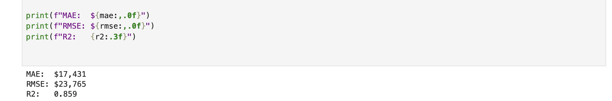
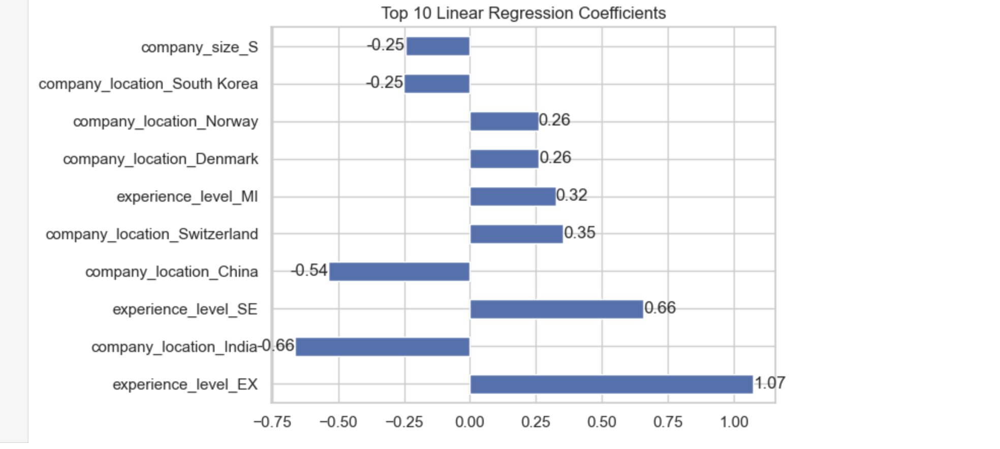

# AI Job Salary Analysis with Machine Learning

This project analyzes AI job market data and investigates which factors influence salary.

## Topics
- Data cleaning
- Exploratory data analysis
- Visualization
- Correlation analysis
- Feature engineering
- Linear regression
- Random forest regression
- Model comparison

## Main findings
- Python, SQL, and TensorFlow are among the most demanded skills.
- Location strongly affects salary levels.
- Company size also influences salary.
- Formal education has only a limited additional effect.
- Salaries can be predicted well with ML models (R² ≈ 0.86).

## Tools
- Python
- Pandas
- NumPy
- Matplotlib
- Seaborn
- Scikit-learn
- Statsmodels
- Jupyter Notebook
- ## Results

### Top Skills

### Salary distribution

### Salary by experience and education

### Correlation matrix

### Machine Learning Results

### Linear Regression Coefficients

